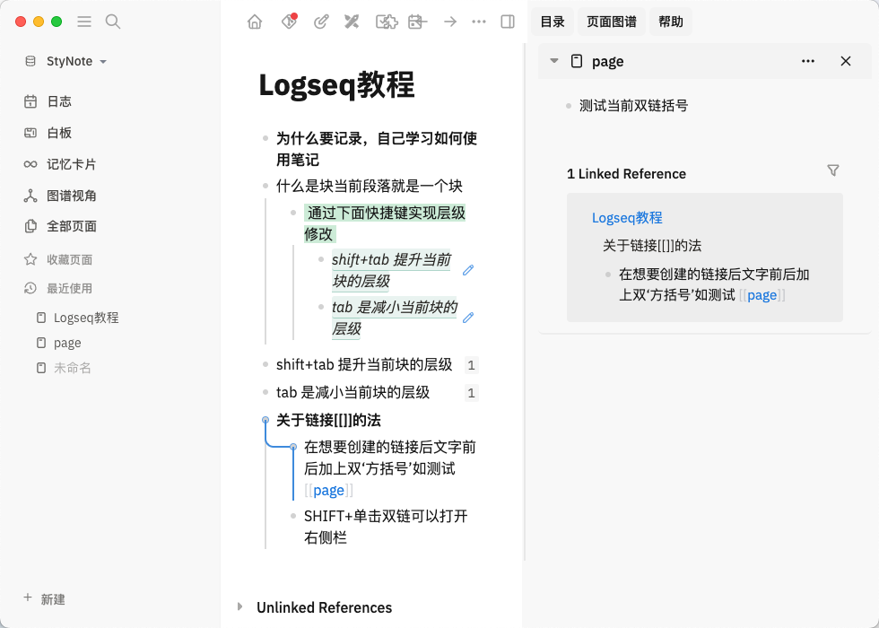

- __为什么要记录，自己学习如何使用笔记__
- 什么是块当前段落就是一个块
	- 通过下面快捷键实现层级修改
	  background-color:: green
		- ((678f36b7-84b6-4a40-a2a0-330fb5392623))
		- ((678f370b-40ff-42f3-8c1a-fe23b59fefeb))
- shift+tab 提升当前块的层级
  id:: 678f36b7-84b6-4a40-a2a0-330fb5392623
- tab 是减小当前块的层级
  id:: 678f370b-40ff-42f3-8c1a-fe23b59fefeb
- #### 关于链接[[]]的法
	- 在想要创建的链接后文字前后加上双‘方括号’如测试 [[page]]
	- SHIFT+单击双链可以打开右侧栏
		- 
		-
- 输入/PAG 选择reference
	- [[测试page]]
- 输入/PAG 选择 embed
	- {{embed [[测试embed]]}}
- [[TODO用法]]
-