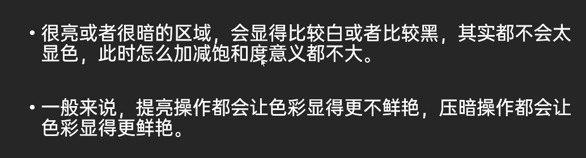

- RGB 加色模型
	- R -> 红色
	- G -> 绿色
	- B -> 蓝色
	- 
- CMYK 青品黄
- 
- HSL
	- 色彩的明度
		- 明度指的是色彩的明暗程度、明度值越高、色彩越亮白、明度越低、色彩越暗黑
		- 白色明度最高、黑色明度最低
		- 相同纯度的不同色相、明度上也有所不同。彩色中黄色明度最高、紫色明度最低。
		- {:height 202, :width 718}
- HSB/HSV